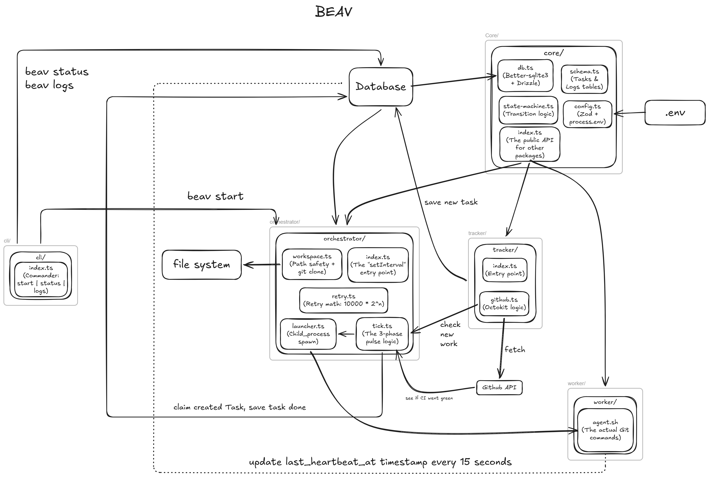
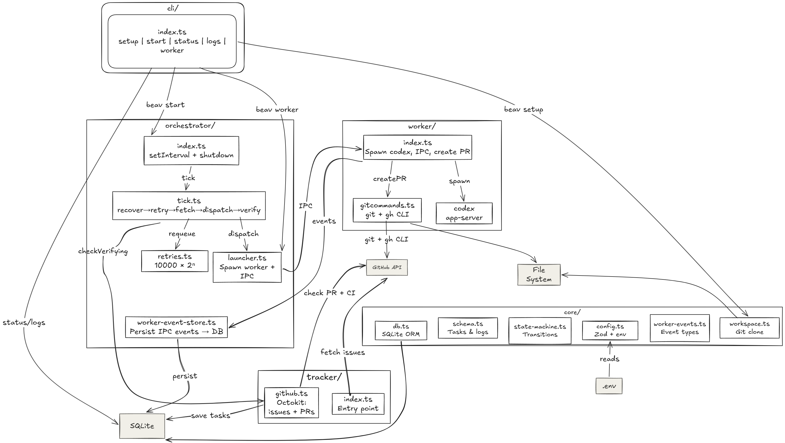
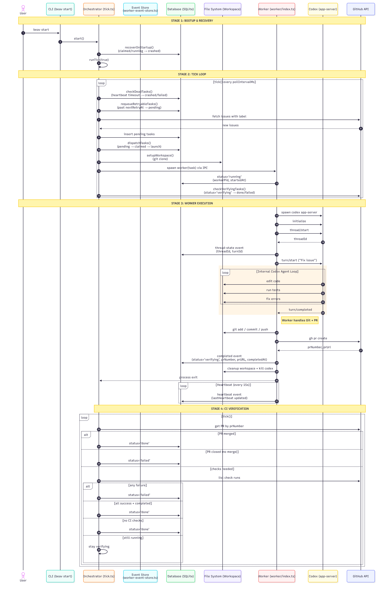

# Beav 🦫

Autonomous GitHub issue resolution system powered by Codex AI agents.

Beav monitors repositories for labeled issues, spawns isolated parallel workers using OpenAI Codex, creates pull requests, verifies CI, and automatically retries failed executions.

## Demo

## System Evolution

Beav evolved through two major architectural phases.

### Phase 1 — Fully Custom Agent Architecture



The initial version of Beav implemented a fully custom autonomous agent pipeline.

The worker layer was responsible for:
- agent reasoning
- tool execution
- memory persistence
- retry coordination
- heartbeat tracking

This architecture focused heavily on building a stateful ReAct-style execution loop from scratch, with the orchestrator managing recovery, retries, and workspace isolation around it.

### Phase 2 — Codex-Native Orchestration Architecture



The architecture later evolved into a Codex-native distributed system.

Instead of implementing custom reasoning internally, Beav now delegates:
- code reasoning
- iterative debugging
- tool usage
- repository modification

to Codex app-server through JSON-RPC IPC communication.

This significantly simplified the worker layer and allowed Beav to focus on:
- orchestration
- concurrent worker execution
- crash recovery
- PR lifecycle management
- CI verification
- task state management

The result is a cleaner and more modular autonomous issue resolution system.

## Execution Flow


## Core Concepts

### Stateful Task Lifecycle

Beav manages every issue through a persistent task state machine:

`pending → claimed → running → verifying → done/failed/crashed`

The orchestrator coordinates all transitions, tracks execution metadata, and monitors worker health through heartbeat updates. Failed or crashed tasks are automatically recovered and requeued according to retry policies and backoff rules.


### Process Isolation

Each task executes inside an isolated git-cloned workspace and dedicated worker process.  
Workers spawn Codex app-server instances and communicate through JSON-RPC IPC channels. Workspace isolation, PID tracking, and file-system safety checks prevent interference between concurrent executions and protect against path traversal outside the workspace boundary.


### Recovery & Retries

Beav continuously monitors worker heartbeats to detect stalled or crashed executions.  
Dead workers are cleaned up automatically, and recoverable tasks are requeued using exponential backoff retry logic. The orchestrator handles crash recovery, retry scheduling, and stale task reconciliation to maintain reliable long-running autonomous execution.

## Architecture

```
┌─────────────────────────────────────────────────────────┐
│                        Beav                             │
├─────────────────────────────────────────────────────────┤
│  Tracker     │ Fetches labeled issues from GitHub     │
│  Orchestrator │ Manages task lifecycle & dispatching   │
│  Worker       │ Executes fixes in isolated workspaces  │
│  CLI          │ User interface for status & logs       │
└─────────────────────────────────────────────────────────┘
```
## Tech Stack

| Layer           | Technology                      |
| --------------- | ------------------------------- |
| Database        | SQLite (WAL mode) + Drizzle ORM |
| API Client      | Octokit REST                    |
| Runtime         | Node.js                         |
| Package Manager | pnpm (monorepo)                 |

## Getting Started

```bash
pnpm install
pnpm build
```

Configure via environment or `beav.config.ts`:

```typescript
{
  ghToken: process.env.GITHUB_TOKEN,
  repoOwner: "owner",
  repoName: "repo",
  issueTitle: "autofix",
  maxConcurrent: 3,
  pollIntervalMs: 30000,
  thresholdMs: 45000,
  workspaceRoot: "./workspaces"
}
```

```bash
beav start    # Start orchestrator
beav status   # View active tasks
beav logs <id># Tail task logs
```

## Example Run Logs:
pranav@Pranav:~/projects/Beav$ ls
Beav_Test_Repo  images  node_modules  package.json  packages  pnpm-lock.yaml  pnpm-workspace.yaml  readme.md  tsconfig.json
pranav@Pranav:~/projects/Beav$ pnpm start

> beav@1.0.0 start /home/pranav/projects/Beav
> pnpm -C packages/cli exec tsx src/index.ts start

◇ injecting env (4) from .env // tip: ◈ secrets for agents [www.dotenvx.com]
17:54:04 INFO [orchestrator] Starting with repo Pranav04027/Beav_Test_Repo
17:54:04 INFO [orchestrator] Poll interval: 30000ms, Max concurrent: 3
17:54:04 INFO [orchestrator] Recovering stale tasks from previous run...
17:54:04 INFO [boot] No stale tasks to recover
17:54:04 INFO [orchestrator] Running first tick...
17:54:04 INFO [tick] ─── Tick started ───
17:54:04 INFO [retry] Requeued task 01KRAM0KQBGAQN27VG34PC070R (failed → pending)
17:54:04 INFO [retry] Requeued task 01KRAM0KQKY1601FBDMJY0WRZK (failed → pending)
17:54:04 INFO [retry] Requeued task 01KRAM0KQKTRNW47H5N2WZNHV6 (failed → pending)
17:54:04 INFO [tracker] Fetching issues from Pranav04027/Beav_Test_Repo with label "autofix"
17:54:04 INFO [tracker] Fetching open issues from Pranav04027/Beav_Test_Repo with label "autofix"
17:54:05 INFO [tracker] Found 11 open issue(s) with label "autofix"
17:54:05 INFO [tracker] Tracked issue #29: Fix sum function returning incorrect total
17:54:05 INFO [tracker] Tracked issue #28: Fix flatten function not flattening nested arrays
17:54:05 INFO [tracker] Tracked issue #27: Fix unique function returning duplicates instead of unique values
17:54:05 INFO [tracker] Tracked issue #26: Fix truncate function not adding ellipsis
17:54:05 INFO [tracker] Tracked issue #25: Fix reverse function producing incorrect output
17:54:05 INFO [tracker] Tracked issue #24: Fix capitalize function capitalizing wrong character
17:54:05 INFO [tracker] Tracked issue #23: Fix factorial(0) returning 0 instead of 1
17:54:05 INFO [tracker] Tracked issue #22: Fix average function dividing by wrong count
17:54:05 INFO [tracker] Tracked issue #21: Fix multiply function returning wrong value
17:54:05 INFO [tracker] Tracked issue #20: Fix subtract function returning incorrect result
17:54:05 INFO [tracker] Tracked issue #19: Fix add function returning incorrect result
17:54:05 INFO [tracker] Sync complete: 11 added, 0 skipped
17:54:05 INFO [tracker] Added 11 new issue(s) to queue
17:54:05 INFO [dispatch] Claiming 3 task(s) for dispatch (0/3 active)
17:54:05 INFO [dispatch] Claimed task 01KRAM0KQBGAQN27VG34PC070R (Fix sum function returning incorrect total)
17:54:05 INFO [dispatch] Claimed task 01KRAM0KQKY1601FBDMJY0WRZK (Fix flatten function not flattening nested arrays)
17:54:05 INFO [dispatch] Claimed task 01KRAM0KQKTRNW47H5N2WZNHV6 (Fix unique function returning duplicates instead of unique values)
17:54:05 INFO [dispatch] Setting up workspace for task 01KRAM0KQBGAQN27VG34PC070R...
17:54:05 INFO [workspace:34PC070R] Creating directory: /home/pranav/projects/Beav/packages/cli/workspaces/01KRAM0KQBGAQN27VG34PC070R
17:54:05 INFO [workspace:34PC070R] Cloning Pranav04027/Beav_Test_Repo...
17:54:07 INFO [workspace:34PC070R] Clone complete
17:54:07 INFO [worker:01KRAM0KQBGAQN27VG34PC070R] Spawned worker PID 4786
17:54:07 INFO [dispatch] Launched task 01KRAM0KQBGAQN27VG34PC070R → worker PID 4786
17:54:07 INFO [dispatch] Setting up workspace for task 01KRAM0KQKY1601FBDMJY0WRZK...
17:54:07 INFO [workspace:MJY0WRZK] Creating directory: /home/pranav/projects/Beav/packages/cli/workspaces/01KRAM0KQKY1601FBDMJY0WRZK
17:54:07 INFO [workspace:MJY0WRZK] Cloning Pranav04027/Beav_Test_Repo...
◇ injecting env (0) from .env // tip: ⌁ auth for agents [www.vestauth.com]
17:54:07 INFO [worker:34PC070R] Issue #29: Fix sum function returning incorrect total
17:54:07 INFO [worker:34PC070R] Workspace: /home/pranav/projects/Beav/packages/cli/workspaces/01KRAM0KQBGAQN27VG34PC070R
17:54:07 INFO [worker:34PC070R] → initialize
17:54:08 INFO [worker:34PC070R] Sending initialized notification
17:54:08 INFO [worker:34PC070R] Starting thread with model gpt-5.4 (full-auto)
17:54:08 INFO [worker:34PC070R] → thread/start
17:54:08 INFO [workspace:MJY0WRZK] Clone complete
17:54:08 INFO [worker:01KRAM0KQKY1601FBDMJY0WRZK] Spawned worker PID 5155
17:54:08 INFO [dispatch] Launched task 01KRAM0KQKY1601FBDMJY0WRZK → worker PID 5155
17:54:08 INFO [dispatch] Setting up workspace for task 01KRAM0KQKTRNW47H5N2WZNHV6...
17:54:08 INFO [workspace:N2WZNHV6] Creating directory: /home/pranav/projects/Beav/packages/cli/workspaces/01KRAM0KQKTRNW47H5N2WZNHV6
17:54:08 INFO [workspace:N2WZNHV6] Cloning Pranav04027/Beav_Test_Repo...
◇ injecting env (0) from .env // tip: ⌘ override existing { override: true }
17:54:08 INFO [worker:MJY0WRZK] Issue #28: Fix flatten function not flattening nested arrays
17:54:08 INFO [worker:MJY0WRZK] Workspace: /home/pranav/projects/Beav/packages/cli/workspaces/01KRAM0KQKY1601FBDMJY0WRZK
17:54:08 INFO [worker:MJY0WRZK] → initialize
17:54:08 INFO [worker:MJY0WRZK] Sending initialized notification
17:54:08 INFO [worker:MJY0WRZK] Starting thread with model gpt-5.4 (full-auto)
17:54:08 INFO [worker:MJY0WRZK] → thread/start
17:54:09 INFO [workspace:N2WZNHV6] Clone complete
17:54:09 INFO [worker:01KRAM0KQKTRNW47H5N2WZNHV6] Spawned worker PID 5523
17:54:09 INFO [dispatch] Launched task 01KRAM0KQKTRNW47H5N2WZNHV6 → worker PID 5523
17:54:09 INFO [tick] Tick completed in 4526ms
17:54:09 INFO [orchestrator] Scheduler active — tick every 30000ms
◇ injecting env (0) from .env // tip: ⌘ suppress logs { quiet: true }
17:54:09 INFO [worker:N2WZNHV6] Issue #27: Fix unique function returning duplicates instead of unique values
17:54:09 INFO [worker:N2WZNHV6] Workspace: /home/pranav/projects/Beav/packages/cli/workspaces/01KRAM0KQKTRNW47H5N2WZNHV6
17:54:09 INFO [worker:N2WZNHV6] → initialize
17:54:09 INFO [worker:34PC070R] Thread started: 019e2279-8493-7e01-8d14-957e20bee392
17:54:09 INFO [worker:34PC070R] → turn/start
17:54:09 INFO [worker:34PC070R] Turn started: 019e2279-84e5-7762-804a-4a6812de3c63. Waiting for completion...
17:54:09 INFO [worker:N2WZNHV6] Sending initialized notification
17:54:09 INFO [worker:N2WZNHV6] Starting thread with model gpt-5.4 (full-auto)
17:54:09 INFO [worker:N2WZNHV6] → thread/start
17:54:09 INFO [worker:N2WZNHV6] Thread started: 019e2279-8591-76d1-8482-589cdb1e62a1
17:54:09 INFO [worker:N2WZNHV6] → turn/start
17:54:09 INFO [worker:N2WZNHV6] Turn started: 019e2279-85b4-7f43-a736-4c1be0cad6f6. Waiting for completion...
17:54:10 INFO [worker:MJY0WRZK] Thread started: 019e2279-864d-74a3-b844-e1f69cdfffea
17:54:10 INFO [worker:MJY0WRZK] → turn/start
17:54:10 INFO [worker:MJY0WRZK] Turn started: 019e2279-8670-7022-8975-cf5116bcb344. Waiting for completion...
17:54:38 INFO [tick] ─── Tick started ───
17:54:38 INFO [tracker] Fetching issues from Pranav04027/Beav_Test_Repo with label "autofix"
17:54:38 INFO [tracker] Fetching open issues from Pranav04027/Beav_Test_Repo with label "autofix"
17:54:39 INFO [tracker] Found 11 open issue(s) with label "autofix"
17:54:39 INFO [tracker] Tracked issue #29: Fix sum function returning incorrect total
17:54:39 INFO [tracker] Tracked issue #28: Fix flatten function not flattening nested arrays
17:54:39 INFO [tracker] Tracked issue #27: Fix unique function returning duplicates instead of unique values
17:54:39 INFO [tracker] Tracked issue #26: Fix truncate function not adding ellipsis
17:54:39 INFO [tracker] Tracked issue #25: Fix reverse function producing incorrect output
17:54:39 INFO [tracker] Tracked issue #24: Fix capitalize function capitalizing wrong character
17:54:39 INFO [tracker] Tracked issue #23: Fix factorial(0) returning 0 instead of 1
17:54:39 INFO [tracker] Tracked issue #22: Fix average function dividing by wrong count
17:54:39 INFO [tracker] Tracked issue #21: Fix multiply function returning wrong value
17:54:39 INFO [tracker] Tracked issue #20: Fix subtract function returning incorrect result
17:54:39 INFO [tracker] Tracked issue #19: Fix add function returning incorrect result
17:54:39 INFO [tracker] Sync complete: 11 added, 0 skipped
17:54:39 INFO [tracker] Added 11 new issue(s) to queue
17:54:39 INFO [dispatch] At capacity: 3/3 workers active
17:54:39 INFO [tick] Tick completed in 767ms
17:55:06 INFO [tick] ─── Tick started ───
17:55:06 INFO [tracker] Fetching issues from Pranav04027/Beav_Test_Repo with label "autofix"
17:55:06 INFO [tracker] Fetching open issues from Pranav04027/Beav_Test_Repo with label "autofix"
17:55:06 INFO [tracker] Found 11 open issue(s) with label "autofix"
17:55:06 INFO [tracker] Tracked issue #29: Fix sum function returning incorrect total
17:55:06 INFO [tracker] Tracked issue #28: Fix flatten function not flattening nested arrays
17:55:06 INFO [tracker] Tracked issue #27: Fix unique function returning duplicates instead of unique values
17:55:06 INFO [tracker] Tracked issue #26: Fix truncate function not adding ellipsis
17:55:06 INFO [tracker] Tracked issue #25: Fix reverse function producing incorrect output
17:55:06 INFO [tracker] Tracked issue #24: Fix capitalize function capitalizing wrong character
17:55:06 INFO [tracker] Tracked issue #23: Fix factorial(0) returning 0 instead of 1
17:55:06 INFO [tracker] Tracked issue #22: Fix average function dividing by wrong count
17:55:06 INFO [tracker] Tracked issue #21: Fix multiply function returning wrong value
17:55:06 INFO [tracker] Tracked issue #20: Fix subtract function returning incorrect result
17:55:06 INFO [tracker] Tracked issue #19: Fix add function returning incorrect result
17:55:06 INFO [tracker] Sync complete: 11 added, 0 skipped
17:55:06 INFO [tracker] Added 11 new issue(s) to queue
17:55:06 INFO [dispatch] At capacity: 3/3 workers active
17:55:06 INFO [tick] Tick completed in 733ms
17:55:11 INFO [worker:MJY0WRZK] Turn completed (status: completed)
17:55:11 INFO [worker:MJY0WRZK] Creating PR...
[pr] Creating branch: beav-fix-01KRAM0KQKY1601FBDMJY0WRZK
[pr] Staging changes...
[pr] Committing: fix: Fix flatten function not flattening nested arrays
[pr] Pushing branch to origin...
[pr] Creating PR for beav-fix-01KRAM0KQKY1601FBDMJY0WRZK → #28
[pr] PR created successfully: https://github.com/Pranav04027/Beav_Test_Repo/pull/30
17:55:17 INFO [worker:MJY0WRZK] Cleaning up workspace
17:55:17 INFO [worker:MJY0WRZK] Killed codex process
17:55:17 INFO [worker:01KRAM0KQKY1601FBDMJY0WRZK] Process exited (code=0, signal=null)
17:55:23 INFO [worker:34PC070R] Turn completed (status: completed)
17:55:23 INFO [worker:34PC070R] Creating PR...
[pr] Creating branch: beav-fix-01KRAM0KQBGAQN27VG34PC070R
[pr] Staging changes...
[pr] Committing: fix: Fix sum function returning incorrect total
[pr] Pushing branch to origin...
[pr] Creating PR for beav-fix-01KRAM0KQBGAQN27VG34PC070R → #29
[pr] PR created successfully: https://github.com/Pranav04027/Beav_Test_Repo/pull/31
17:55:28 INFO [worker:34PC070R] Cleaning up workspace
17:55:28 INFO [worker:34PC070R] Killed codex process
17:55:28 INFO [worker:01KRAM0KQBGAQN27VG34PC070R] Process exited (code=0, signal=null)
17:55:33 INFO [tick] ─── Tick started ───
17:55:33 INFO [tracker] Fetching issues from Pranav04027/Beav_Test_Repo with label "autofix"
17:55:33 INFO [tracker] Fetching open issues from Pranav04027/Beav_Test_Repo with label "autofix"
17:55:34 INFO [tracker] Found 11 open issue(s) with label "autofix"
17:55:34 INFO [tracker] Tracked issue #29: Fix sum function returning incorrect total
17:55:34 INFO [tracker] Tracked issue #28: Fix flatten function not flattening nested arrays
17:55:34 INFO [tracker] Tracked issue #27: Fix unique function returning duplicates instead of unique values
17:55:34 INFO [tracker] Tracked issue #26: Fix truncate function not adding ellipsis
17:55:34 INFO [tracker] Tracked issue #25: Fix reverse function producing incorrect output
17:55:34 INFO [tracker] Tracked issue #24: Fix capitalize function capitalizing wrong character
17:55:34 INFO [tracker] Tracked issue #23: Fix factorial(0) returning 0 instead of 1
17:55:34 INFO [tracker] Tracked issue #22: Fix average function dividing by wrong count
17:55:34 INFO [tracker] Tracked issue #21: Fix multiply function returning wrong value
17:55:34 INFO [tracker] Tracked issue #20: Fix subtract function returning incorrect result
17:55:34 INFO [tracker] Tracked issue #19: Fix add function returning incorrect result
17:55:34 INFO [tracker] Sync complete: 11 added, 0 skipped
17:55:34 INFO [tracker] Added 11 new issue(s) to queue
17:55:34 INFO [dispatch] At capacity: 3/3 workers active
17:55:34 INFO [verifier] Checking 2 verifying task(s)
17:55:34 INFO [verifier] Processing batch 1 (2 tasks)
17:55:35 INFO [verify:01KRAM0KQBGAQN27VG34PC070R] PR #31: state=open, merged=false
17:55:35 INFO [verify:01KRAM0KQKY1601FBDMJY0WRZK] PR #30: state=open, merged=false
17:55:35 INFO [worker:N2WZNHV6] Turn completed (status: completed)
17:55:35 INFO [worker:N2WZNHV6] Creating PR...
[pr] Creating branch: beav-fix-01KRAM0KQKTRNW47H5N2WZNHV6
[pr] Staging changes...
[pr] Committing: fix: Fix unique function returning duplicates instead of unique values
[pr] Pushing branch to origin...
17:55:35 INFO [verify:01KRAM0KQBGAQN27VG34PC070R] No CI checks found → waiting for merge
17:55:36 INFO [verify:01KRAM0KQKY1601FBDMJY0WRZK] No CI checks found → waiting for merge
17:55:36 INFO [tick] Tick completed in 2038ms
[pr] Creating PR for beav-fix-01KRAM0KQKTRNW47H5N2WZNHV6 → #27
[pr] PR created successfully: https://github.com/Pranav04027/Beav_Test_Repo/pull/32
17:55:43 INFO [worker:N2WZNHV6] Cleaning up workspace
17:55:43 INFO [worker:N2WZNHV6] Killed codex process
17:55:43 INFO [worker:01KRAM0KQKTRNW47H5N2WZNHV6] Process exited (code=0, signal=null)
17:56:01 INFO [tick] ─── Tick started ───
17:56:01 INFO [tracker] Fetching issues from Pranav04027/Beav_Test_Repo with label "autofix"
17:56:01 INFO [tracker] Fetching open issues from Pranav04027/Beav_Test_Repo with label "autofix"
17:56:02 INFO [tracker] Found 11 open issue(s) with label "autofix"
17:56:02 INFO [tracker] Tracked issue #29: Fix sum function returning incorrect total
17:56:02 INFO [tracker] Tracked issue #28: Fix flatten function not flattening nested arrays
17:56:02 INFO [tracker] Tracked issue #27: Fix unique function returning duplicates instead of unique values
17:56:02 INFO [tracker] Tracked issue #26: Fix truncate function not adding ellipsis
17:56:02 INFO [tracker] Tracked issue #25: Fix reverse function producing incorrect output
17:56:02 INFO [tracker] Tracked issue #24: Fix capitalize function capitalizing wrong character
17:56:02 INFO [tracker] Tracked issue #23: Fix factorial(0) returning 0 instead of 1
17:56:02 INFO [tracker] Tracked issue #22: Fix average function dividing by wrong count
17:56:02 INFO [tracker] Tracked issue #21: Fix multiply function returning wrong value
17:56:02 INFO [tracker] Tracked issue #20: Fix subtract function returning incorrect result
17:56:02 INFO [tracker] Tracked issue #19: Fix add function returning incorrect result
17:56:02 INFO [tracker] Sync complete: 11 added, 0 skipped
17:56:02 INFO [tracker] Added 11 new issue(s) to queue
17:56:02 INFO [dispatch] At capacity: 3/3 workers active
17:56:02 INFO [verifier] Checking 3 verifying task(s)
17:56:02 INFO [verifier] Processing batch 1 (3 tasks)
17:56:03 INFO [verify:01KRAM0KQBGAQN27VG34PC070R] PR #31: state=open, merged=false
17:56:03 INFO [verify:01KRAM0KQKTRNW47H5N2WZNHV6] PR #32: state=open, merged=false
17:56:03 INFO [verify:01KRAM0KQKY1601FBDMJY0WRZK] PR #30: state=open, merged=false
17:56:03 INFO [verify:01KRAM0KQKTRNW47H5N2WZNHV6] No CI checks found → waiting for merge
17:56:03 INFO [verify:01KRAM0KQKY1601FBDMJY0WRZK] No CI checks found → waiting for merge
17:56:03 INFO [verify:01KRAM0KQBGAQN27VG34PC070R] No CI checks found → waiting for merge
17:56:03 INFO [tick] Tick completed in 2164ms
17:56:29 INFO [tick] ─── Tick started ───
17:56:29 INFO [tracker] Fetching issues from Pranav04027/Beav_Test_Repo with label "autofix"
17:56:29 INFO [tracker] Fetching open issues from Pranav04027/Beav_Test_Repo with label "autofix"
17:56:30 INFO [tracker] Found 10 open issue(s) with label "autofix"
17:56:30 INFO [tracker] Tracked issue #29: Fix sum function returning incorrect total
17:56:30 INFO [tracker] Tracked issue #28: Fix flatten function not flattening nested arrays
17:56:30 INFO [tracker] Tracked issue #26: Fix truncate function not adding ellipsis
17:56:30 INFO [tracker] Tracked issue #25: Fix reverse function producing incorrect output
17:56:30 INFO [tracker] Tracked issue #24: Fix capitalize function capitalizing wrong character
17:56:30 INFO [tracker] Tracked issue #23: Fix factorial(0) returning 0 instead of 1
17:56:30 INFO [tracker] Tracked issue #22: Fix average function dividing by wrong count
17:56:30 INFO [tracker] Tracked issue #21: Fix multiply function returning wrong value
17:56:30 INFO [tracker] Tracked issue #20: Fix subtract function returning incorrect result
17:56:30 INFO [tracker] Tracked issue #19: Fix add function returning incorrect result
17:56:30 INFO [tracker] Sync complete: 10 added, 0 skipped
17:56:30 INFO [tracker] Added 10 new issue(s) to queue
17:56:30 INFO [dispatch] At capacity: 3/3 workers active
17:56:30 INFO [verifier] Checking 3 verifying task(s)
17:56:30 INFO [verifier] Processing batch 1 (3 tasks)
17:56:30 INFO [verify:01KRAM0KQBGAQN27VG34PC070R] PR #31: state=open, merged=false
17:56:31 INFO [verify:01KRAM0KQKY1601FBDMJY0WRZK] PR #30: state=open, merged=false
17:56:31 INFO [verify:01KRAM0KQKTRNW47H5N2WZNHV6] PR #32: state=closed, merged=true
17:56:31 INFO [verify:01KRAM0KQKTRNW47H5N2WZNHV6] PR merged → deleting from DB
17:56:31  ERR [verify:01KRAM0KQKTRNW47H5N2WZNHV6] Verification error SqliteError: FOREIGN KEY constraint failed
    at PreparedQuery.run (/home/pranav/projects/Beav/node_modules/.pnpm/drizzle-orm@0.45.2_@types+better-sqlite3@7.6.13_better-sqlite3@12.8.0/node_modules/src/better-sqlite3/session.ts:132:20)
    at QueryPromise.resultCb (/home/pranav/projects/Beav/node_modules/.pnpm/drizzle-orm@0.45.2_@types+better-sqlite3@7.6.13_better-sqlite3@12.8.0/node_modules/src/sqlite-core/session.ts:185:61)
    at QueryPromise.execute (/home/pranav/projects/Beav/node_modules/.pnpm/drizzle-orm@0.45.2_@types+better-sqlite3@7.6.13_better-sqlite3@12.8.0/node_modules/src/sqlite-core/session.ts:31:15)
    at QueryPromise.then (/home/pranav/projects/Beav/node_modules/.pnpm/drizzle-orm@0.45.2_@types+better-sqlite3@7.6.13_better-sqlite3@12.8.0/node_modules/src/query-promise.ts:31:15)
    at process.processTicksAndRejections (node:internal/process/task_queues:95:5) {
  code: 'SQLITE_CONSTRAINT_FOREIGNKEY'
}
17:56:31 INFO [verify:01KRAM0KQBGAQN27VG34PC070R] No CI checks found → waiting for merge
17:56:31 INFO [verify:01KRAM0KQKY1601FBDMJY0WRZK] No CI checks found → waiting for merge
17:56:31 INFO [tick] Tick completed in 2079ms
17:56:57 INFO [tick] ─── Tick started ───
17:56:57 INFO [tracker] Fetching issues from Pranav04027/Beav_Test_Repo with label "autofix"
17:56:57 INFO [tracker] Fetching open issues from Pranav04027/Beav_Test_Repo with label "autofix"
17:56:57 INFO [tracker] Found 9 open issue(s) with label "autofix"
17:56:57 INFO [tracker] Tracked issue #28: Fix flatten function not flattening nested arrays
17:56:57 INFO [tracker] Tracked issue #26: Fix truncate function not adding ellipsis
17:56:57 INFO [tracker] Tracked issue #25: Fix reverse function producing incorrect output
17:56:57 INFO [tracker] Tracked issue #24: Fix capitalize function capitalizing wrong character
17:56:57 INFO [tracker] Tracked issue #23: Fix factorial(0) returning 0 instead of 1
17:56:57 INFO [tracker] Tracked issue #22: Fix average function dividing by wrong count
17:56:57 INFO [tracker] Tracked issue #21: Fix multiply function returning wrong value
17:56:57 INFO [tracker] Tracked issue #20: Fix subtract function returning incorrect result
17:56:57 INFO [tracker] Tracked issue #19: Fix add function returning incorrect result
17:56:57 INFO [tracker] Sync complete: 9 added, 0 skipped
17:56:57 INFO [tracker] Added 9 new issue(s) to queue
17:56:57 INFO [dispatch] At capacity: 3/3 workers active
17:56:57 INFO [verifier] Checking 3 verifying task(s)
17:56:57 INFO [verifier] Processing batch 1 (3 tasks)
17:56:58 INFO [verify:01KRAM0KQBGAQN27VG34PC070R] PR #31: state=closed, merged=true
17:56:58 INFO [verify:01KRAM0KQBGAQN27VG34PC070R] PR merged → deleting from DB

## Future Improvements